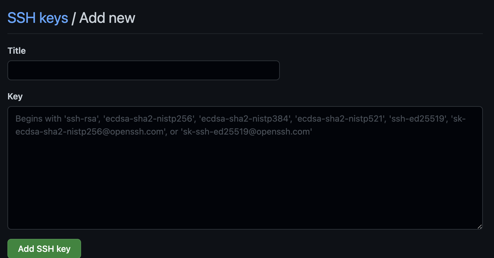

# Connecting to GitHub via SSH

If you plan to use Github from your local device, the recommended way to authenticate is using Secure Shell, or SSH for short. This requires the creation of keys: a public and a private key. The advantage of using SSH is that you don't need to enter in your credentials when interacting with the remote repository. The keys are generated and stored on your local machine and then the public key is copied to the Github server. After you finish setting up, every operation will be authenticated using the keys.

### Generate SSH keys

The process is the same for both Windows and Mac. On Windows, you can use the Git Bash terminal and on Mac, the standard terminal will work.

1. Open the terminal
2. Enter the following: ssh-keygen -t ed25519 -C "your@email.com"
3. Replace the email with your own and press enter.
4. It will prompt to enter a password. Hit enter to skip setting a password and do the same for entering the same passphrase again. Generating public/private ed25519 key pair. Enter passphrase (empty for no passphrase):  Enter same passphrase again:  Your identification has been saved in ./ssh/private_key. Your public key has been saved in ./ssh/public_key.pub. The key fingerprint is: SHA256:UDQI5N1FL3QSq7Gj1o12mkr9Me7qGMZAeE1s9BWIln4 your@email.com The key's randomart image is: +--[ED25519 256]--+ |   .o+o=+oOo.    | |   o +B+.= =     | |  . +++ + o .    | |   o  ..E+ .     | |    .  .S        | |     o + +       | |      B = =      | |     + + * o     | |      oo=o+      | +----[SHA256]-----+
5. Once you have confirmed it will generate the above to confirm the keys have been created.
6. Both keys will be stored in the .ssh folder.
7. In order to add our key to Github, we need to get a copy of the public key which is always identified as .pub in your local directory. Find the name of the key file using the below command. ls ~/.ssh/ Then, use the below command to copy the file, replacing the <YOUR KEY> with the name of the key file on your device. pbcopy < ~/.ssh/<YOUR KEY>.pub

## Adding Your Keys to Github

We now need to add our public key to Github to grant access to the repositories we create.

**Step 1:** Log on to Github

**Step 2:** Click on the profile icon in the top right of the screen and select Settings.

**Step 3:** On the Settings screen, on the left-hand side under the Access section, click SSH and GPG Keys

**Step 4:** Click the New SSH key button in Green on the right-hand side of the screen.

**Step 5:** Enter a title and paste in your public key that you copied previously.

**Step 6:** Click the Add SSH key button.

You are now ready to access Github via SSH.

## Accessing Repositories

When accessing a repository and using SSH authentication, make sure to always use the SSH address of the repository.

